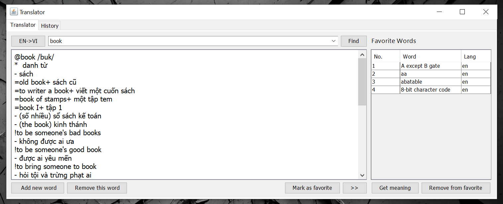

## Getting Started

To get started, you need to have the following installed:

- [Java Development Kit (JDK)](https://www.oracle.com/technetwork/java/javase/downloads/index.html) (version 8 or above)

## Folder Structure

The workspace contains two folders by default, where:

- `Source`: the folder to maintain sources
- `Libs`: the folder to maintain dependencies
- `Files`: the folder containing the input files

Meanwhile, the compiled output files will be generated in the `Release` folder by default.

> If you want to customize the folder structure, open `.vscode/settings.json` and update the related settings there.

## Compiling and Running

To compile your code, open the terminal in the root of your workspace and run the following command:

```bash
javac -d Release -cp Source Source/App.java
```

The above command compiles the code in `Source` folder and generates the output in `Release` folder.

To run your code, open the terminal and run the following command:

```bash
java -cp Release App
```

The above command runs the code in `Release` folder.

You can also execute the `translator.jar` file to run the application.

## Features

The GUI of the application is built using Java Swing.



The application has the following features:

- Look up meaning of a word in the dictionary in English or Vietnamese.
- Add a new word to the dictionary.
- Remove a word from the dictionary.
- Switch between English and Vietnamese.
- Mark a word as a favorite word.
- View all favorite words and sort them by alphabetical order.
- Remove a word from the favorite list.
- View history of words that have been looked up from a date to another date.

## Author

Võ Phi Hùng ([@phihungtf](https://github.com/phihungtf))

- 20120489 ([20120489@student.hcmus.edu.vn](mailto:20120489@student.hcmus.edu.vn))
- Personal e-mail: [phihungtf@gmail.com](mailto:phihungtf@gmail.com)
